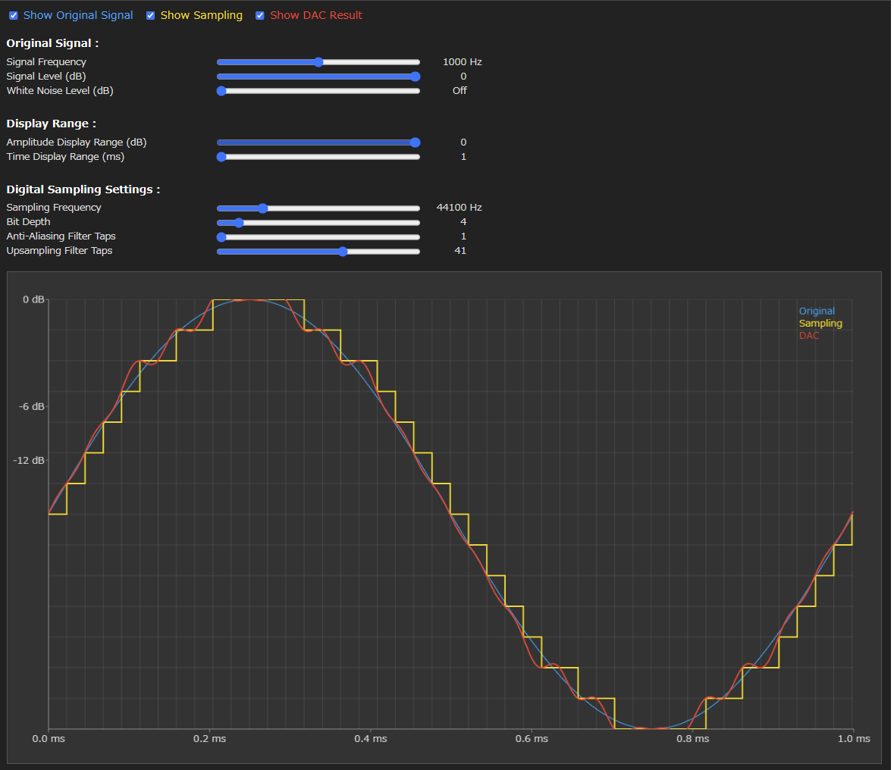

# Frieve Digital Sampling Visualizer

This application visually and intuitively shows how the original waveform is sampled in digital audio, and how the original waveform is reconstructed from the sampled waveform.
You can easily compare how the audio waveform changes with different sampling frequencies and bit depths by looking at the color-coded graphs.

[> Open the App](https://frieve-a.github.io/sound_toolbox/digital_sampling_visualizer/digital_sampling_visualizer.html)

## Usage

Use the sliders at the top to adjust the original signal's frequency, level, noise, as well as the sampling parameters such as sampling frequency and bit depth.
Use the checkboxes "Show Original Signal" (blue), "how Sampling" (yellow), and "Show DAC Result" (red) to switch on/off the respective waveforms of the original analog signal, the quantized digital signal, and the signal after DAC.
Experiment with various settings to see how the waveform of the original analog signal changes compared to the waveform after the DAC.

## Key Point
Digital sampling can reproduce the original waveform surprisingly faithfully within the important audible range. In modern audio, it's rarely a real problem that the signal is represented by digital steps.
R2R DACs, which claim to play back the digital waveform as-is, produce an output waveform that looks nothing like the original analog waveform. It's crap. Don't be fooled!
---

デジタルオーディオにおいて元波形がサンプリングされる様子、サンプリングされた波形を元に元波形が再現される様子をビジュアル、直感的に体験できるアプリです。
音の波形がサンプリング周波数、ビット数の設定でどのように変わっていくのかについて、色分けされたのグラフで簡単に見比べることができます。

[> アプリを開く](https://frieve-a.github.io/sound_toolbox/digital_sampling_visualizer_ja/digital_sampling_visualizer_ja.html)

## 使い方

上部のスライドバーでサンプリングする元信号の「周波数」「レベル」「ノイズ」、サンプリングのパラメータである「サンプリング周波数」「bit数」などを調整。
「元信号表示」(青)、「サンプリング表示」(黄色)、 「DAC結果表示」(赤)のチェックボックスで、それぞれ元のアナログ信号、サンプリングにより量子化された階段状のデジタル信号、DAC後の信号の波形表示のON/OFFを切り替えます。
設定を様々に変更し、元のアナログ信号の波形の元波形とDAC後の信号の波形がどのように変化するか確かめてみましょう。

## ポイント

デジタルサンプリングは重要な可聴帯域において驚くほど忠実に元の波形を再現します。現代においてデジタル段階で階段状に表現されることはほとんど問題ではありません。
デジタル波形をそのまま再生することをうたうR2R DACの出力波形は元のアナログ波形とは似ても似つかないクソです。皆さん騙されないで！