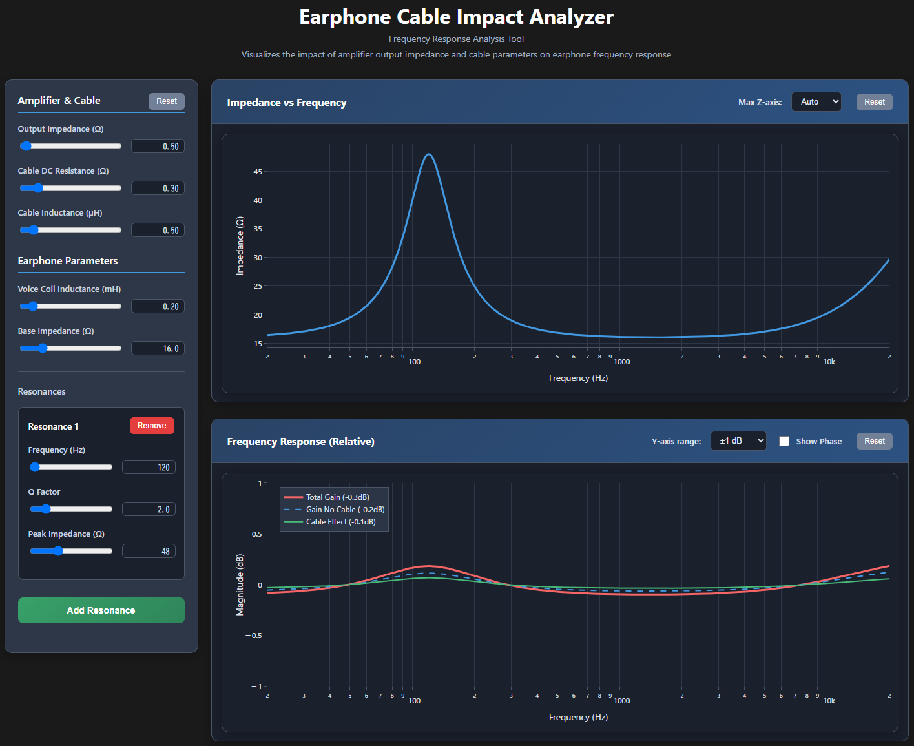

# Earphone Cable Impact Analyzer

## Overview
Earphone Cable Impact Analyzer is an interactive web application that visualizes the impact of amplifier output impedance and cable parameters on earphone frequency response. The tool provides analysis of impedance characteristics and frequency response changes across the audio spectrum.

## Launch the App
[Launch the App](./ecia.html)

## Features
- Visualization of earphone impedance vs frequency characteristics
- Interactive analysis of frequency response changes due to cable effects
- Customizable amplifier output impedance and cable parameters
- Multiple resonance modeling for complex earphone impedance characteristics
- Phase response visualization option
- Relative frequency response display with separate cable effect visualization
- Anomaly detection for potentially problematic parameter combinations

## Configuration Options

**Output Impedance (Ω)**
- Slider Range: 0 to 20 (step 0.1)
- Default: 0.5
The amplifier's output impedance affects the damping factor and frequency response. Lower values (< 1Ω) are typical for modern amplifiers and provide better control over the earphone driver. Higher values may cause audible frequency response variations, especially with multi-driver earphones.

**Cable DC Resistance (Ω)**
- Slider Range: 0 to 2 (step 0.01)
- Default: 0.30
The DC resistance of the cable affects the overall damping and can cause slight frequency response changes. Values above 1Ω (marked as anomaly) may indicate poor quality cables or very long cable runs that could impact sound quality.

**Cable Inductance (µH)**
- Slider Range: 0 to 5 (step 0.1)
- Default: 0.5
Cable inductance primarily affects high-frequency response. Most quality audio cables have inductance below 1µH. Higher values (marked as anomaly) may cause audible high-frequency roll-off.

**Voice Coil Inductance (mH)**
- Slider Range: 0.01 to 2 (step 0.01)
- Default: 0.20
The inductance of the earphone's voice coil affects high-frequency response. Typical values range from 0.1-1.0mH. Higher values may cause more pronounced frequency response variations when combined with amplifier output impedance.

**Base Impedance (Ω)**
- Slider Range: 4 to 64 (step 1)
- Default: 16
The nominal impedance of the earphone at low frequencies. Common values are 16Ω, 32Ω, and higher. Very low impedances (≤8Ω, marked as anomaly) may be difficult to drive properly with some amplifiers.

**Resonances**
- Frequency Range: 20Hz to 20kHz
- Q Factor Range: 0.5 to 10
- Peak Impedance Range: 16Ω to 116Ω
Multiple resonances can be added to model complex earphone impedance characteristics. Each resonance creates a peak in impedance at the specified frequency. High impedance ratios (Zmax/Zmin ≥ 5) are marked as anomalies as they may cause significant frequency response variations.

**Plot Controls**
- Impedance plot: Adjustable Y-axis scaling (Auto, 100Ω, 200Ω, 500Ω)
- Frequency response plot: Y-axis range (±0.1dB, ±1dB, ±10dB) and optional phase display
- Frequency response shows three traces: Total Gain (with cable), Gain without cable effects, and Cable Effect (difference)

----

## 概要
Earphone Cable Impact Analyzerは、アンプの出力インピーダンスとケーブルパラメータがイヤホンの周波数特性に与える影響を視覚化するインタラクティブなWebアプリケーションです。オーディオ帯域全体にわたるインピーダンス特性と周波数特性の変化を解析できます。

## アプリを起動
[アプリを起動](./ecia.html)

## 特徴
- イヤホンのインピーダンス vs 周波数特性の視覚化
- ケーブル効果による周波数特性変化のインタラクティブ解析
- アンプ出力インピーダンスとケーブルパラメータのカスタマイズ機能
- 複雑なイヤホンインピーダンス特性のためのマルチ共振モデリング
- 位相応答視覚化オプション
- ケーブル効果を分離した相対周波数特性表示
- 問題となる可能性のあるパラメータ組み合わせの異常検出

## 各設定項目の解説

**出力インピーダンス（Ω）**
- Slider Range: 0 to 20 (step 0.1)
- Default: 0.5
アンプの出力インピーダンスはダンピングファクタと周波数特性に影響します。低い値（< 1Ω）は現代のアンプの一般的な値で、イヤホンドライバーの制御性を向上させます。高い値は特にマルチドライバーイヤホンで可聴な周波数特性変化を引き起こす可能性があります。

**ケーブル直流抵抗（Ω）**
- Slider Range: 0 to 2 (step 0.01)
- Default: 0.30
ケーブルの直流抵抗は全体的なダンピングに影響し、わずかな周波数特性変化を引き起こします。1Ω以上の値（異常表示）は品質の悪いケーブルや非常に長いケーブルを示し、音質に影響する可能性があります。

**ケーブルインダクタンス（µH）**
- Slider Range: 0 to 5 (step 0.1)
- Default: 0.5
ケーブルインダクタンスは主に高周波特性に影響します。高品質オーディオケーブルの多くは1µH以下です。高い値（異常表示）は可聴な高周波減衰を引き起こす可能性があります。

**ボイスコイルインダクタンス（mH）**
- Slider Range: 0.01 to 2 (step 0.01)
- Default: 0.20
イヤホンのボイスコイルのインダクタンスは高周波特性に影響します。一般的な値は0.1-1.0mHの範囲です。高い値はアンプ出力インピーダンスとの組み合わせでより顕著な周波数特性変化を引き起こす可能性があります。

**ベースインピーダンス（Ω）**
- Slider Range: 4 to 64 (step 1)
- Default: 16
低周波数でのイヤホンの公称インピーダンスです。一般的な値は16Ω、32Ω、それ以上です。非常に低いインピーダンス（≤8Ω、異常表示）は一部のアンプでは適切に駆動することが困難な場合があります。

**共振特性**
- 周波数範囲: 20Hz to 20kHz
- Q Factor範囲: 0.5 to 10
- ピークインピーダンス範囲: 16Ω to 116Ω
複雑なイヤホンインピーダンス特性をモデル化するために複数の共振を追加できます。各共振は指定された周波数でインピーダンスピークを作成します。高いインピーダンス比（Zmax/Zmin ≥ 5）は重要な周波数特性変化を引き起こす可能性があるため異常として表示されます。

**プロット制御**
- インピーダンスプロット: Y軸スケール調整（Auto、100Ω、200Ω、500Ω）
- 周波数特性プロット: Y軸範囲（±0.1dB、±1dB、±10dB）とオプションの位相表示
- 周波数特性は3つのトレースを表示：トータルゲイン（ケーブル込み）、ケーブル効果なしのゲイン、ケーブル効果（差分）