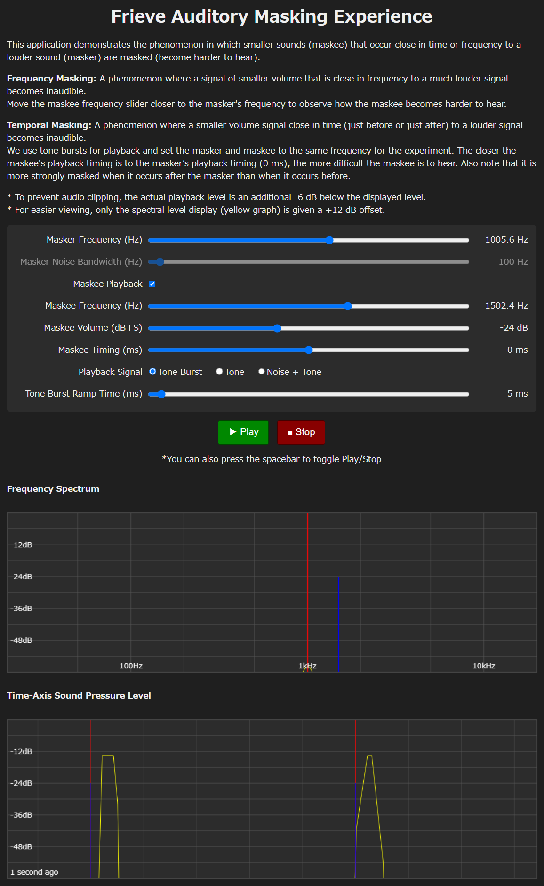
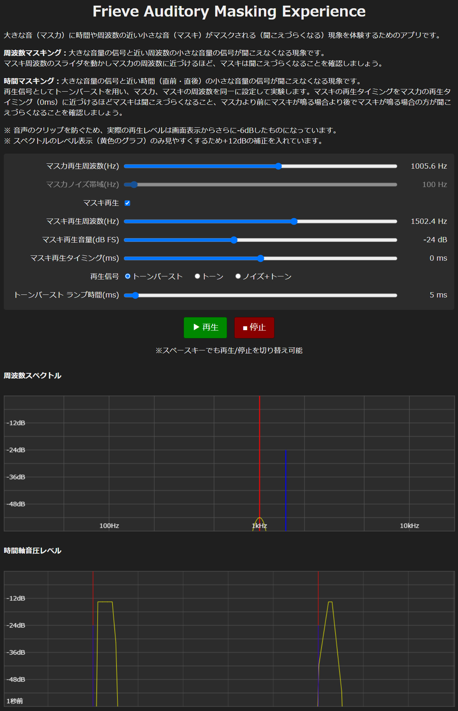

# Frieve Auditory Masking Experience

This application demonstrates the phenomenon in which smaller sounds (maskee) that occur close in time or frequency to a louder sound (masker) are masked (become harder to hear).

[> Open the App](https://frieve-a.github.io/sound_toolbox/masking_experience/masking_experience.html)

---

大きな音（マスカ）に時間や周波数の近い小さな音（マスキ）がマスクされる（聞こえづらくなる）現象を体験するためのアプリです。

[> アプリを開く](https://frieve-a.github.io/sound_toolbox/masking_experience/masking_experience_ja.html)

