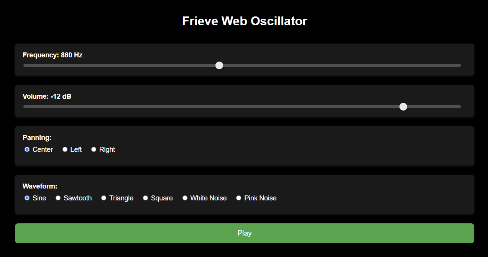

# Frieve Web Oscillator

An oscillator app that plays simple waveforms.  [> Open App](https://frieve-a.github.io/sound_toolbox/oscillator/oscillator.html)

| Control Item | Description                         |
|--------------|-------------------------------------|
| Frequency    | Frequency of playback sound (Hz)    |
| Volume       | Volume of playback sound (dBFS)     |
| Panning      | Output channel                      |
| Waveform     | Type of waveform to be played       |
| Play / Pause | Start and stop playback (SPACE key) |

## Example Uses

- Checking the frequency range that a speaker can reproduce
- Checking the frequency range audible to your ears
- Checking the minimum audible volume for your ears
- Checking distortion at different frequencies of the speaker
- Checking resonance and reverberation at different frequencies in the playback environment

---

シンプルな波形を再生するオシレーターアプリ [> アプリを開く](https://frieve-a.github.io/sound_toolbox/oscillator/oscillator.html)

| 操作項目     | 説明                        |
|--------------|-----------------------------|
| Frequency    | 再生音の周波数 (Hz)         |
| Volume       | 再生音のボリューム (dBFS)   |
| Panning      | 出力先チャンネル            |
| Waveform     | 再生する波形の種類          |
| Play / Pause | 再生の開始と停止 (SPACEキー)|

## 用途の例

- スピーカーの再生可能な周波数範囲の確認
- 自分の耳に聞こえる周波数範囲の確認
- 耳に聞こえる最小音量の確認
- スピーカーの周波数ごとの歪みの確認
- 再生環境における周波数ごとの共鳴共振の発生の確認
