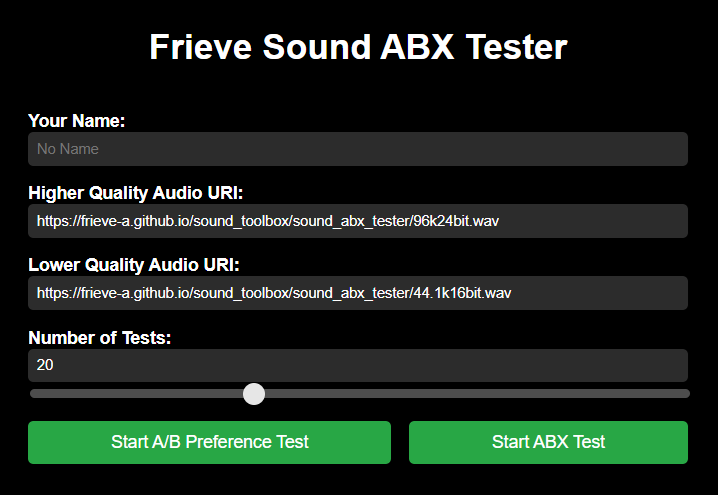
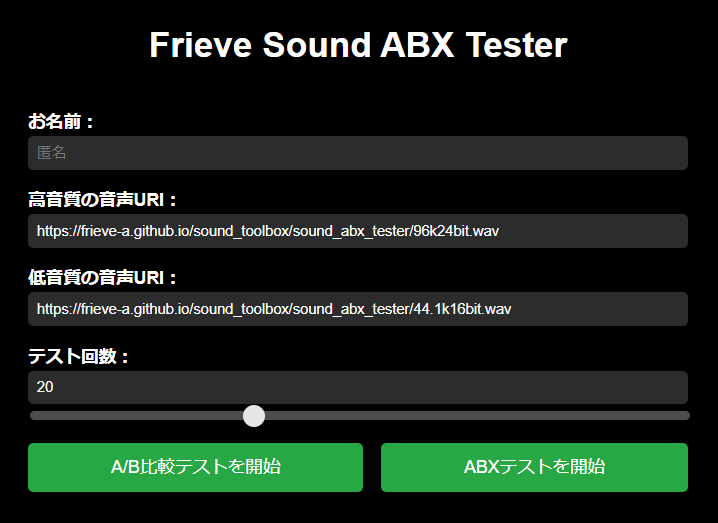

# Frieve Sound ABX Tester

Frieve Sound ABX Tester is an app designed to test whether you can distinguish differences between two sound files.
[> Open the App](https://frieve-a.github.io/sound_toolbox/sound_abx_tester/sound_abx_tester.html?data=eyJuIjoiIiwidUgiOiJodHRwczovL2ZyaWV2ZS1hLmdpdGh1Yi5pby9zb3VuZF90b29sYm94L3NvdW5kX2FieF90ZXN0ZXIvOTZrMjRiaXQud2F2IiwidUwiOiJodHRwczovL2ZyaWV2ZS1hLmdpdGh1Yi5pby9zb3VuZF90b29sYm94L3NvdW5kX2FieF90ZXN0ZXIvMTI4a2Jwcy5tcDMiLCJ0VCI6IkFCUFJFRiIsImNDIjowLCJ0QyI6MCwidGMiOjIwLCJ0cyI6MH0-)

## How to Use

- Enter the URIs of the high-quality and low-quality audio files in their respective fields.
- Specify the number of tests to be performed. Increasing the number of tests will yield more accurate results, but will take more time.
- By sharing the URL, you can share the same test with others.
- Choose either an A/B preference test to see which audio quality is better, or an ABX test to determine whether X is the same as A or B, then start the test.
- Randomly shuffled audio will be presented, so press the play button to listen. Each sample can be played as many times as needed.
- In the A/B preference test, select the audio you entered as the high-quality one, and in the ABX test, select whether X matches A or B.
- When the specified number of tests is completed, the app displays your correct answer rate, the time taken to make each judgment, and whether we can confidently say you noticed the difference.
- Press the "Share Results" button to copy the URL for sharing your results to the clipboard.

---

Frieve Sound ABX Tester は、2つの音声ファイルの差異を聞き分けることができるかどうかのテストを行うためのアプリです。
[> アプリを開く](https://frieve-a.github.io/sound_toolbox/sound_abx_tester/sound_abx_tester_ja.html?data=eyJuIjoiIiwidUgiOiJodHRwczovL2ZyaWV2ZS1hLmdpdGh1Yi5pby9zb3VuZF90b29sYm94L3NvdW5kX2FieF90ZXN0ZXIvOTZrMjRiaXQud2F2IiwidUwiOiJodHRwczovL2ZyaWV2ZS1hLmdpdGh1Yi5pby9zb3VuZF90b29sYm94L3NvdW5kX2FieF90ZXN0ZXIvMTI4a2Jwcy5tcDMiLCJ0VCI6IkFCUFJFRiIsImNDIjowLCJ0QyI6MCwidGMiOjIwLCJ0cyI6MH0-)

## 使い方

- 高音質の音声URIと、低音質の音声URIの欄に、それぞれ音声ファイルのURIを入力します。
- テスト回数を指定します。テスト回数を増やすほど結果は正確になりますが、その分時間がかかります。
- 設定時点でのURLをシェアすることで、同じテストを他の人と共有できます。
- どちらの音質がより良いか選ぶA/B比較テスト、もしくはXはAとBのどちらと同じ音声か判定するABXテストのどちらかを選択して開始します。
- ランダムにシャッフルされた音声が提示されますので、再生ボタンを押してそれぞれの音声を確認します。各音声サンプルは何度でも再生可能です。
- A/B比較テストでは高音質の音声として入力した方の音声を、ABXテストではXと同じ音声をA、Bから選択します。
- 指定回数のテストが終わると正答率、判断に要した時間、差が分かったと言えるかなどの成績が表示されます。
- 結果を共有ボタンを押して、結果を共有するためのURLをクリップボードにコピーします。
